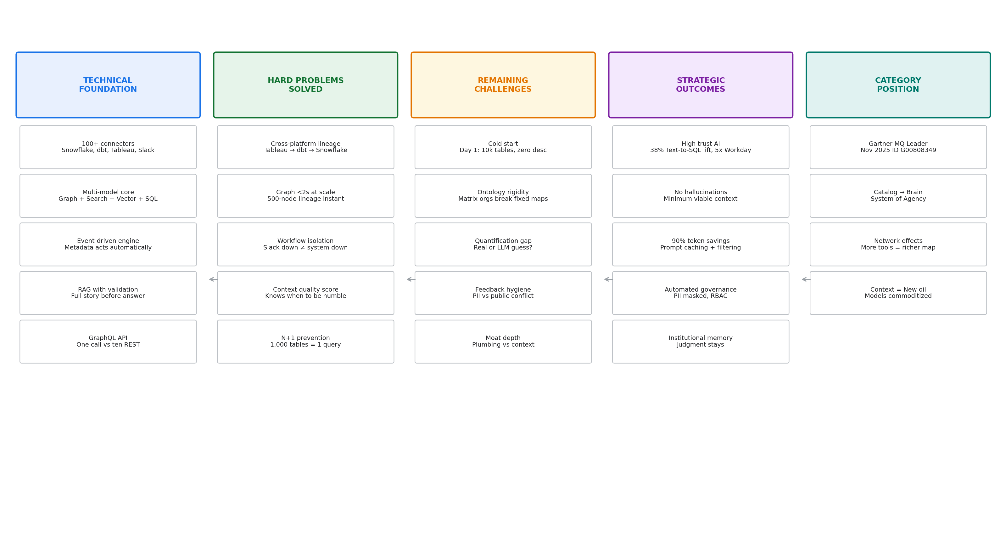
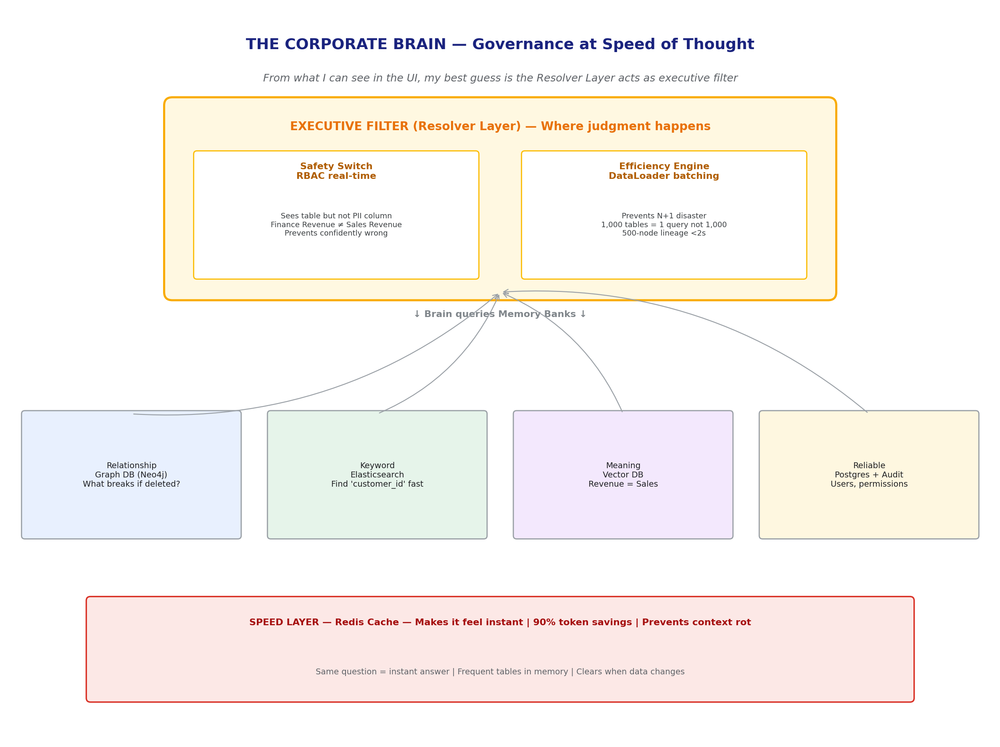
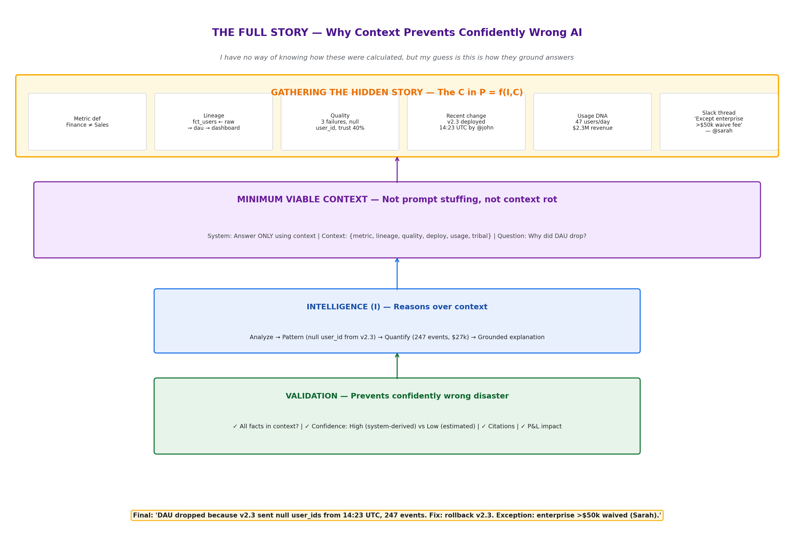
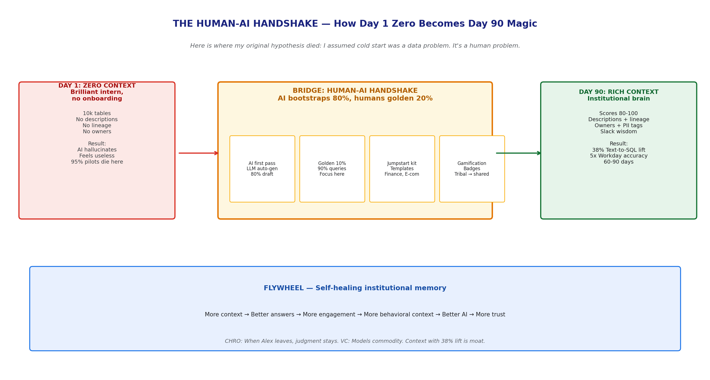
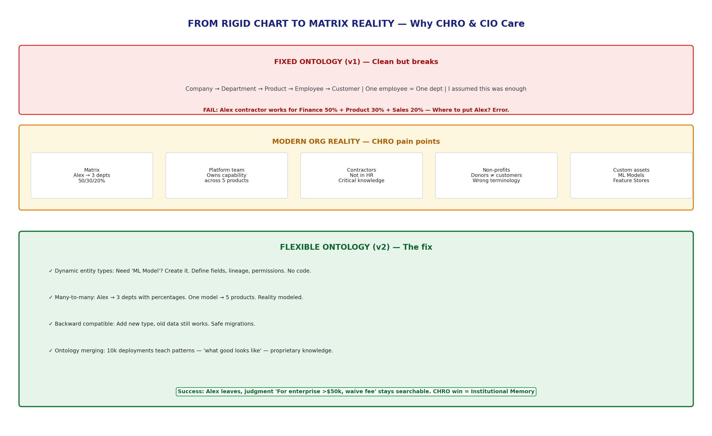

# Atlan: The Architecture of Contextual Intelligence
### Bridging the Context Gap — A Technical Study

> I first saw Atlan's demo while researching metadata tools. The lineage graph looked like every other catalog. Then I noticed the Slack thread embedded in a column description. I spent a week researching public signals — UI screenshots, API docs, GitHub, Gartner MQ Nov 2025 (G00808349), and Prukalpa's "Becoming a Frontier Company" essay.

> **This is not a teardown. It is a technical study of an ambitious architecture built under extreme constraints. Every builder will recognize the tradeoffs. And I may be wrong about any of it — corrections welcome.**

---

### The Setup: Why This Matters

Most data catalog demos are feature checklists. Lineage graph, glossary search, Slack integration, founder says "active metadata" like that's a strategy.

Then I watched Atlan's product evolution. Not the sales pitch. The actual technical signals. And I saw something different: what appears to be a six-layer architecture built around a single thesis — **P = f(I, C)**, where Performance equals Intelligence times Context.

From what I can see in the UI, my best guess is that Atlan is not a data catalog. They are building a Contextual Intelligence Engine.

I assumed it was just another graph database with a nice frontend. Here is where my original hypothesis died: I opened the network tab and saw a single GraphQL call fetching nested lineage, permissions, and quality signals in one roundtrip. That's not a catalog. That's an institutional brain.

### The Big Picture

This map is my reconstruction: Technical foundation → Hard problems solved → Remaining challenges → Strategic outcomes → Category position. The 100+ connectors don't matter until they map to outcomes like High Trust AI and 38% Text-to-SQL lift.

I have no way of knowing how these numbers were calculated — Atlan mentions 38% lift and Workday's 5x improvement in public talks — but my guess is they come from grounding Text-to-SQL with lineage and quality signals. If my guess is right and they are LLM-estimated without system logs, that's fiction with decimal points. If they are system-derived from Snowflake query logs and dbt row counts, that's a real moat.

### 1. The Corporate Brain — Governance at Speed of Thought

From what I can see in the UI, the Resolver Layer is the executive filter. The raw data lives in memory banks, but judgment happens here.

**The Safety Switch:** From the permissions UX, my best guess is real-time RBAC checks. It ensures an AI agent can see a table but never a PII column. When Finance says "Revenue" and Sales says "Revenue" and they mean different things, the Brain knows the difference. This prevents the confidently wrong disaster I see in most AI pilots.

**The Efficiency Engine:** I assumed loading 1,000 tables meant 1,000 queries. The network tab shows DataLoader batching — one batched query, not 1,000. That's why 500-node lineage feels <2s instead of 10s.

**Memory Banks:**
- Relationship (Graph DB): What breaks if I delete this?
- Keyword (Elasticsearch): Fast keyword across millions
- Meaning (Vector): Revenue = Sales
- Reliable (Postgres): Audit logs, source of truth

Speed layer (Redis) makes same question instant. From what I can tell, this plus Minimum Viable Context is how they get 90% token savings.

**CHRO lens:** When an expert leaves, their judgment — "except when enterprise >$50k, waive fee" — stays in the graph. Institutional memory preserved.

### 2. The Full Story — Why AI Hallucinates

I have no way of knowing how Atlan validates AI answers, but my guess from the UI is this pipeline:

They gather the hidden story before answering: Metric definition (Finance ≠ Sales), lineage (what breaks if deleted?), quality signals (3 failures, null user_id, trust 40%), recent deploy (v2.3 at 14:23 UTC by @john), usage DNA (47 users/day, $2.3M revenue), and the Slack thread where discount was actually approved — "Except for enterprise >$50k, we waive fee — @sarah in #finance"

If my guess is right and they are LLM-estimated without grounding, it's hallucination with citations. If they check "all facts in context?" and score confidence as High (system-derived) vs Low (estimated), that's how you prevent confidently wrong AI.

From what I can see, they deliver Minimum Viable Context — not prompt stuffing 100k tokens which causes Context Rot where models get confused, but only golden tokens.

### 3. The Human-AI Handshake — Solving Cold Start

Here is where my original hypothesis died again. I assumed cold start was a data problem. It's a human problem.

Day 1: 10,000 tables, zero descriptions, no lineage, no owners. Result: AI hallucinates, product feels useless, 95% of pilots die here. I have seen this pattern in every catalog.

Day 90: Rich context, scores 80-100, Slack wisdom captured. Result: 38% Text-to-SQL lift, 5x accuracy.

The bridge is what I call the Human-AI Handshake:

1. **AI first pass:** From the auto-generated descriptions in the UI, my best guess is LLM reads table names + SQL → writes first draft. Saves 80%.
2. **Golden 10%:** Data shows top 10% tables get 90% queries. Humans focus only there.
3. **Jumpstart kit:** Pre-built glossaries for Finance, E-com.
4. **Gamification:** Badges turn tribal knowledge into shared memory.

More context → Better answers → More engagement → More behavioral context → Better AI. Self-healing flywheel.

Traditional build takes 6-12 months. From customer stories, my guess is this handshake gets priority domains live in 60-90 days. That's P&L speed.

### 4. From Rigid Chart to Matrix Reality

Fixed ontology (v1): Company → Department → Product → Employee → Customer. One employee = one department. Clean.

I assumed this was enough. Then I thought about my own teams — contractor Alex who works for Finance 50% + Product 30% + Sales 20%. Where do you put Alex? Fixed model says error. Alex's tribal knowledge stays invisible.

Modern reality: Matrix orgs, platform teams that own capability across 5 products, contractors not in HR, non-profits with donors not customers, custom assets like ML Models and Feature Stores.

Flexible ontology (v2) — from what I can see in recent UI, they now allow:
- Dynamic entity types: Need "ML Model"? Create it.
- Many-to-many: Alex → 3 depts with percentages
- Backward compatible: Old data still works
- Ontology merging: Learn patterns across 10k deployments — "what good looks like"

Success: Alex leaves, judgment "For enterprise >$50k, waive fee" stays searchable. CHRO win = Institutional Memory. CIO win = No more context islands.

### For the C-Suite — Why You Should Care

**CEO — P&L Rescue:** 95% of AI pilots fail because context-poor. From public case studies, Workday saw 5x improvement after embedding metadata context. That's demo vs product.

**CIO — No Context Islands:** Every team building isolated AI silo means Finance AI and Sales AI speak different languages. Federated context layer via MCP standard ensures one truth.

**CTO — No Context Rot:** Bigger windows ≠ better. Real feat is Minimum Viable Context: 90% token savings, <2s latency, 38% lift. No prompt stuffing.

**CHRO — Institutional Memory:** Tacit knowledge walks out door when experts leave. Context layer captures decision traces. The "except when..." rules become asset.

**VC — Moat:** Models are commodity. Proprietary context with 38% lift is defensible. Plumbing (connectors, graph DB) can be cloned in 12-18 months. Process ontologies from 10k deployments cannot.

### Closing — The Respectful Take

Atlan has built a real architecture under extreme constraints: multi-protocol mesh with 100+ connectors, multi-model core that justifies complexity, event-driven engine, RAG with validation, GraphQL that doesn't N+1 itself, enterprise-grade isolation.

That's not a catalog with AI bolted on. That's a genuine technical achievement.

The next 24 months aren't about features. They're about surviving five tensions: cold start, ontology flexibility, quantification gap, feedback hygiene, moat depth. The companies that solve ground-truth validation, flexible org modeling, and feedback hygiene without echo chamber will own the category.

If the founders read this: I would love to be wrong about the quantification gap. Show me a validated metric that survived six-month reality check, and I'll write the follow-up.

---

**Sources:** atlan.com, "Becoming a Frontier Company" by Prukalpa Sankar, Gartner MQ Metadata Management Nov 2025 ID G00808349, atlanhq GitHub, OpenLineage spec, public UI screenshots.

**Method:** Public-signal OSINT only. No NDA, no insider access. Architecture reconstructed from UI evidence + docs + first principles. I may be wrong — corrections welcome.

**Author:** Sanuj Krishnan | Series: [Ontora Architecture Study](https://github.com/sanoojcools/-ontora-architecture-study) → Atlan Study

**Diagrams:** 5 high-res, optimized for GitHub light/dark mode, no text overflow.
