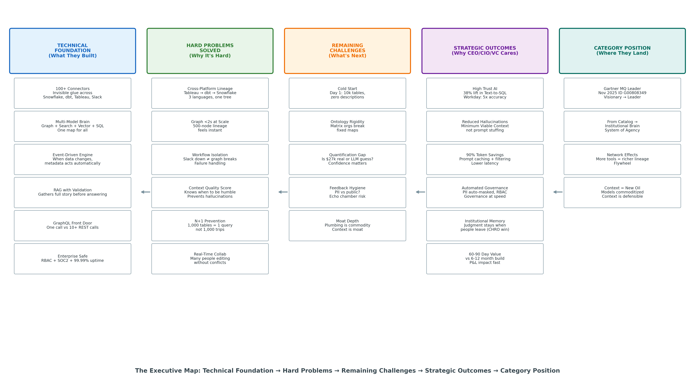
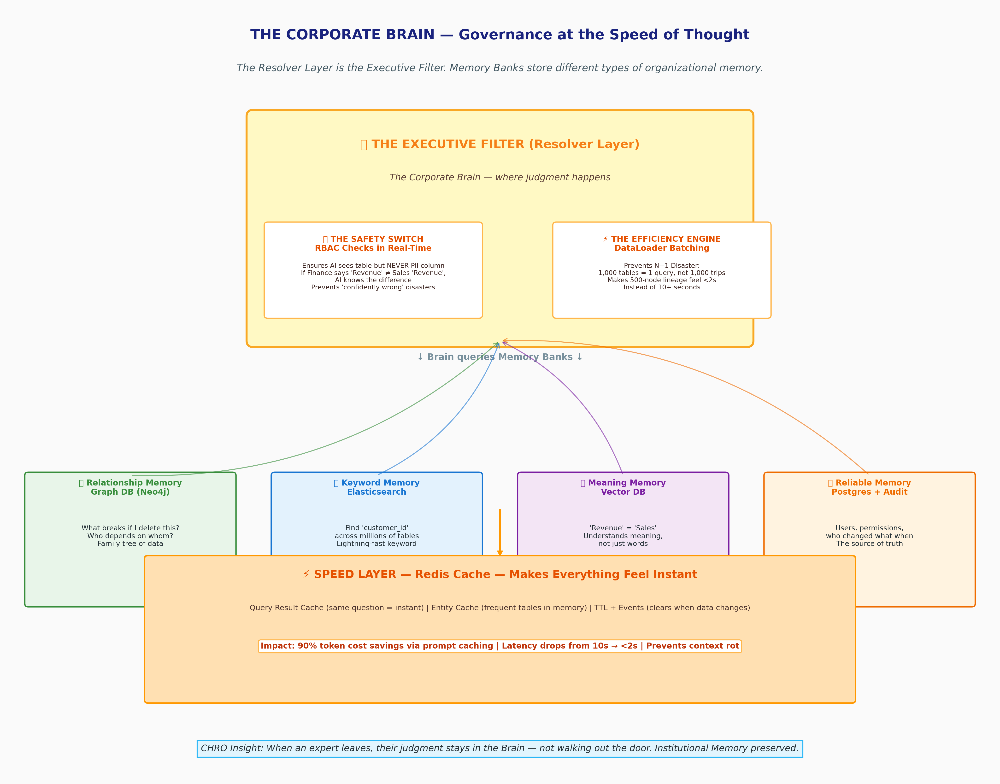
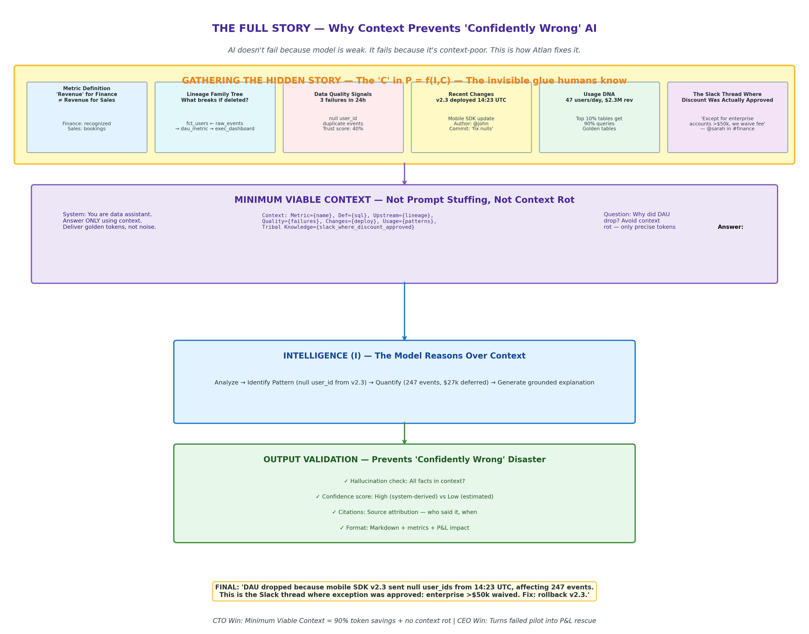
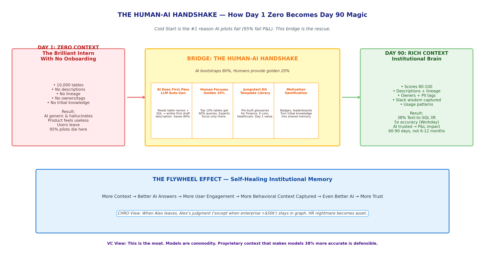
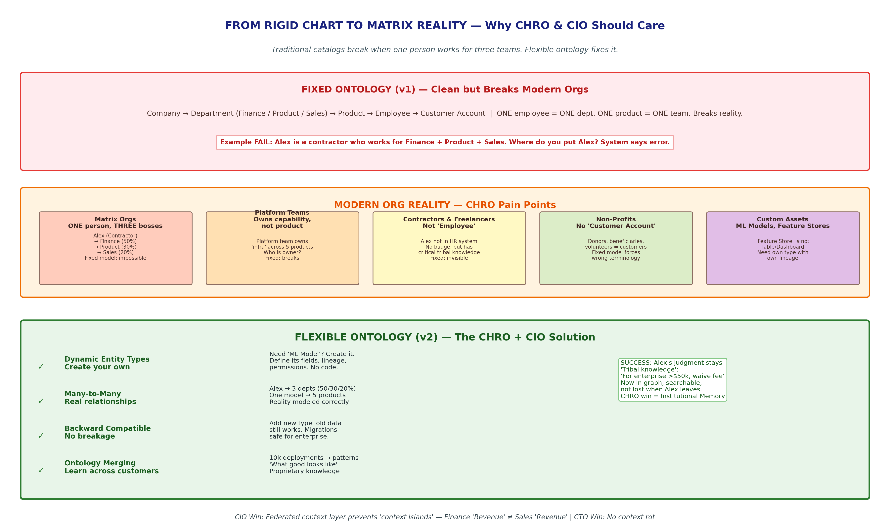

# Atlan: The Architecture of Contextual Intelligence
### Why Context is the New Oil — The Institutional Brain for the Age of AI Agency

> 95% of AI pilots fail P&L, not because models are weak, but because AI is context-poor. 
> **P = f(I, C) — Performance = Intelligence x Context**

This is a public-signal reconstruction of Atlan's architecture — from metadata catalog to AI-native knowledge engine. Part 2 of [Ontora Study](https://github.com/sanoojcools/-ontora-architecture-study).

**Full doc:** [ATLAN-The-Intelligence-Moat-World-Class.docx](./ATLAN-The-Intelligence-Moat-World-Class.docx)

---

## Executive Summary

We built Systems of Record → Systems of Intelligence → Now **Systems of Agency** (AI that acts). The bottleneck is no longer the model, it's **Context** — the invisible glue, tribal knowledge, "except when..." judgment calls.

Formula: **P = f(I, C)**. Atlan built the Context Layer.

## 1. The Executive Map — From Tech to P&L

**Technical → Strategic Outcomes:** 100+ connectors, multi-model brain, event-driven → 38% Text-to-SQL lift, Workday 5x accuracy, 90% token savings, 60-90 day value vs 6-12 month build → Gartner MQ Leader Nov 2025 G00808349.

## 2. The Corporate Brain — Governance at Speed of Thought

**Resolver Layer = Executive Filter.** Memory Banks:
- Relationship (Neo4j): What breaks if deleted?
- Keyword (Elasticsearch): Fast search
- Meaning (Vector): Revenue = Sales
- Reliable (Postgres): Audit, permissions

**Safety Switch (RBAC):** Sees table, not PII. Finance Revenue ≠ Sales Revenue. 
**Efficiency Engine (DataLoader):** 1,000 tables = 1 query, <2s.

**CHRO Win:** When expert leaves, judgment stays in graph.

## 3. The Full Story — Stop Confidently Wrong AI

Gathers hidden story: Metric def, lineage, quality (3 failures), recent deploy v2.3, usage DNA (47 users/day, $2.3M), **Slack thread where discount was approved**.

Minimum Viable Context, not prompt stuffing. Prevents Context Rot.

## 4. Human-AI Handshake — Solving Cold Start

Day 1: 10k tables zero context → 95% pilots die. Day 90: Rich context flywheel.

Bridge: AI auto-gen 80% → Humans focus Golden 10% (90% queries) → Template library → Gamification.

## 5. Rigid to Matrix Reality

Fixed ontology breaks: Contractor Alex in 3 departments (Finance 50% + Product 30% + Sales 20%).

Flexible: Dynamic entity types, many-to-many, backward compatible, ontology merging across 10k deployments.

---

## C-Suite Aha!

**CEO — P&L Rescue:** Turns experiments into revenue. Workday 5x. 
**CIO — No Context Islands:** Federated layer via MCP, like warehouse for BI. 
**CTO — No Context Rot:** 90% token savings, 38% lift. 
**CHRO — Institutional Memory:** Tacit knowledge stays when people leave. 
**VC — Moat:** Models commodity. Proprietary context with 38% lift is defensible.

## Files

- `atlan_enhanced_*.png` — 5 high-res narrative diagrams (optimized for GitHub)
- `ATLAN-The-Intelligence-Moat-World-Class.docx` — World-class formatted doc
- `ATLAN-Enhanced-Executive-Teardown.md` — Full markdown

## Sources

atlan.com, Becoming a Frontier essay, Gartner MQ G00808349, atlanhq GitHub, OpenLineage. OSINT only.

---
**Author:** Sanuj Krishnan | Series: Ontora → Atlan
